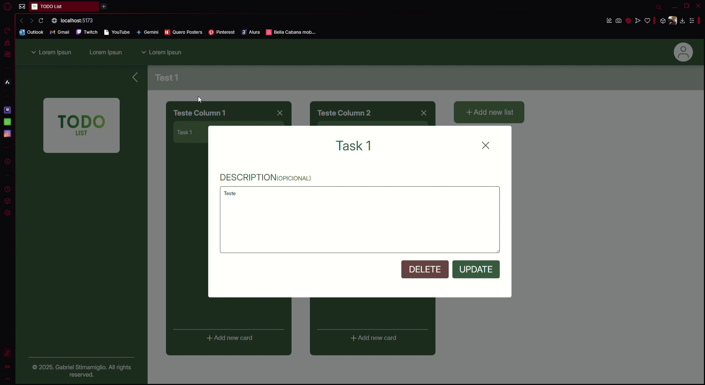

<h1 align="left">Project TODO List</h1>

###

This project is intended to be part of my portfolio. With this project, I intend to improve my basic skills in React, creating a To Do List based entirely on the Trello software, with dynamic creation of columns and cards both with DnD functions. No AI was used ❌

###

<h2 align="left">Features</h2>

<h3 align="left">Collapsed Sidebar</h3>

<h3 align="left">Create Columns and Tasks</h3>

<h3 align="left">Change Names</h3>

<h3 align="left">Add Task Description</h3>

<h3 align="left">Delete Task</h3>

<h3 align="left">Sorting The Columns </h3>

<h3 align="left">Change Task Column</h3>

<h3 align="left">Sorting Ther Tasks</h3>

<h3 align="left">Delete Columns</h3>

###

<h2 align="left">Application</h2>

###

Application created using Vite

- `npm run dev` : Run the development environment;
- `npm run server` : Run the JSON-server;

###

<h3 align="left">Dependencies</h3>

###

- `axios`: `^1.8.1`
- `json-server`: `^1.0.0-beta.3`
- `react`: `^19.0.0`
- `react-dom`: `^19.0.0`
- `uuid`: `^11.1.0`

###

<h3 align="left">To run the project</h3>

###

1. To run this project we first need to run the `npm run server` command, this will make the json-server lib run and bring up the backend mock;
2. After that we just need to run `npm run dev` to bring up the application and use it on the port provided;

###

<h2 align="left">I code with</h2>

###

  
  
  
  
  
  
  
  
  

###